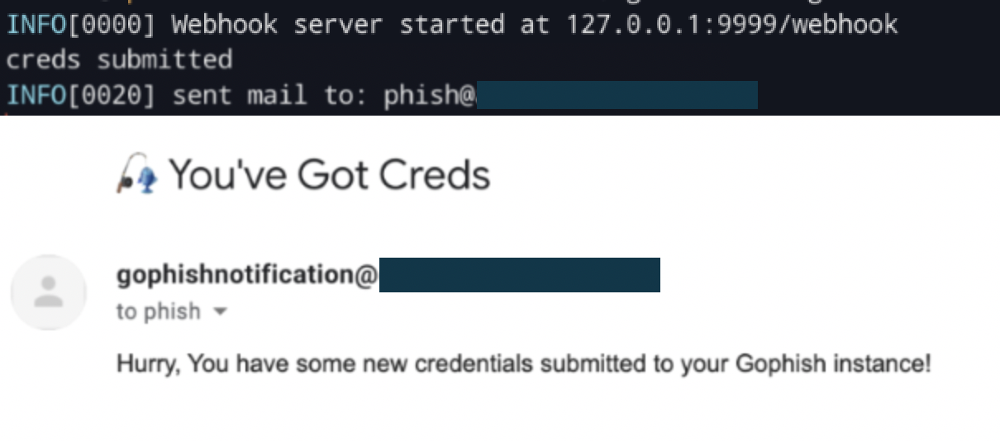

# gophish-notifications
A  webhook server to send email notifications when a target has submitted credentials to a Gophish landing page.



## Background
Gophish added support for webhooks in release version 9.0. Several applications (such as; slack, discord, etc) support webhooks which allow us to get campaign updates pushed as they happen. There are several different events which Gophish supports and each event has the following format:

```
{
    "email": "foo.bar@example.com",
    "time": "2020-01-20T17:33:55.553906Z",
    "message": "Submitted Data",
    "details": "<event details here such as password submitted etc>"
}
```
(Sample event for a target submitting credentials to the phishing site)


## Usage
1. Edit the SMTP credentials (enter your username and password).

2. Edit `to` and `from` fields.

3. Run the webhook server:
`./webhook --sercret <YourSecretHere>`


## Todo
* Take SMTP details as a script argument.
* Implement this in Gophish. Perhaps a notifications menu in the admin portal?


## Resources
* https://docs.getgophish.com/user-guide/documentation/webhooks
* https://github.com/gophish/webhook/blob/master/main.go
* https://golang.org/pkg/net/smtp/
* https://golang.org/src/net/smtp/example_test.go
